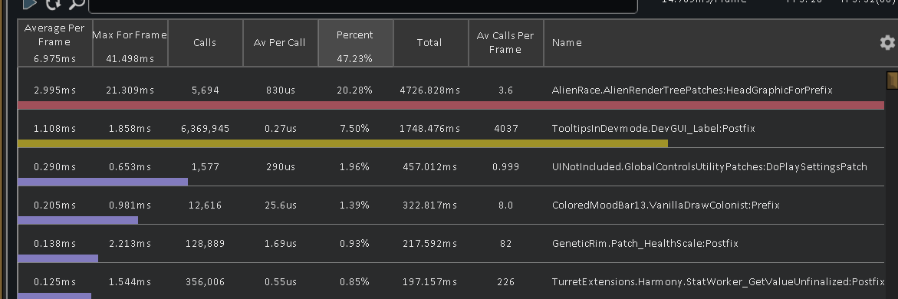
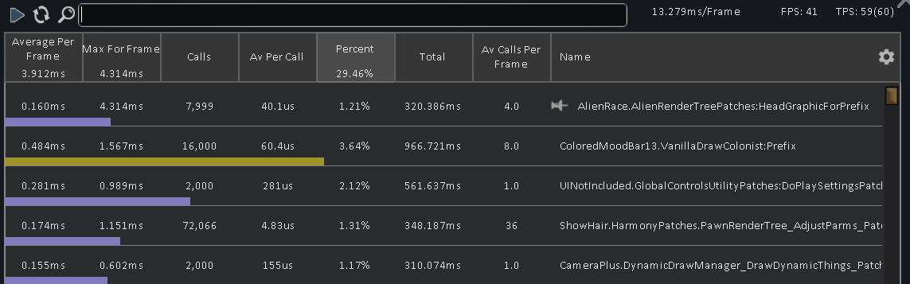
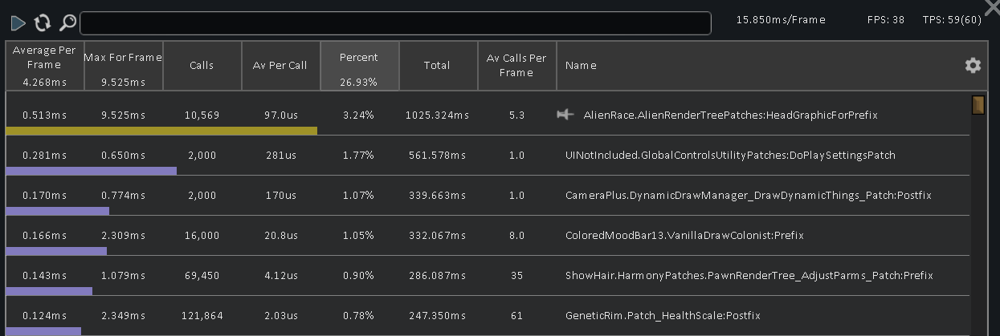
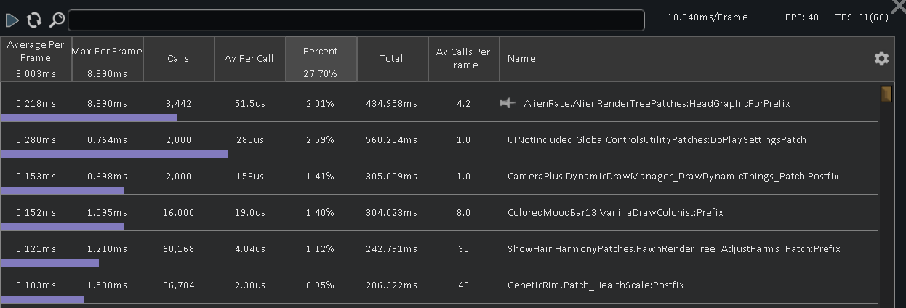

# Rimworld HAR CheckMaskShader Patch

This is an experimental patch for [Humanoid Alien Races](https://github.com/erdelf/AlienRaces) for Rimworld 1.6 that caches the results of CheckMaskShader() to speed up its calls.

## Why?

In my modlist (now 1000 mods with this one), there was an issue of HAR calling HeadGraphicForPrefix() many times per second, and each call goes through all of my 58,000 texture files as far as I can tell. Most of the time was spent on the CheckMaskShader() method within it, and caching the results for that method was simple.

## Should I use this?

To be completely honest, I don't understand the consequences of this patch 100%. I have tested it by running a dev quick test world with this patch enabled and found no obvious issues, but I don't know what issues might arise later.

As it stands currently, shaders are cached once and never again until the game is reloaded.

I can't recommend relying on this unless you understand what it is doing and what problem it solves.

Also, if you have a light modlist then this patch will probably provide very little improvement.

## Installation

### Manual

Clone this repository into the `Mods` folder in your Rimworld install directory.

(Or you can click the green `Code` button above and press `Download Zip` and extract the zip to the folder instead.)

Default folder locations (Info taken from <https://rimworldwiki.com/wiki/Modding_Tutorials/Mod_Folder_Structure>):

1. Windows: `C:\Program Files (x86)\Steam\steamapps\common\RimWorld\Mods`
2. Mac: `~/Library/Application Support/Steam/steamapps/common/RimWorld/RimWorldMac.app/Mods`
3. Linux (Steam): `~/.steam/steam/steamapps/common/RimWorld/Mods`
4. Linux (GOG): `/home/<user>/GOG/Games/RimWorld/game/Mods/`

Note that these locations may be different depending on whether you used a Steam library on another drive, used GOG or changed the GOG install directory.

### Rimsort (Recommended!)

In Rimsort's top bar, select `Download -> Add Git Mod` and put the URL of this repository in the text prompt that comes up.

Once it downloads, press `Refresh` near the bottom to make the mod show in the left pane and drag it to the right pane.

You can update the mod by right clicking it and selected `Miscellaneous options -> Update mod with git`.

You may get a warning that this mod lacks a publish field ID. If this happens, select the mod and press add to ignore list.

## Does it work?

### Anecdotal remarks

Barring any issues discussed above, I did find that this helps improve performance for me personally.

Prior to running this patch, my game would drop tons of frames when zoomed out due to HeadGraphicForPrefix() being called more, and it seemed to be worse if HAR pawns were present though not exclusive to HAR pawns.

With the patch, zooming out can still reduce the frame rate but to a lesser degree.

### Test 1: No patch, 3 baseliners and 5 HAR pawns, Whole map in view. 1 minute of data collection

TPS was around 40, with many fluctuations.

FPS was 20-35.

### Test 2: Patch without tick based renewal, 3 baseliners and 5 HAR pawns, Whole map in view. 1 minute of data collection

TPS stayed around 60.

FPS averaged 40 while zoomed out.

### Test 3: Patch with 30 tick (0.5s) cache entry lifetime, 3 baseliners and 5 HAR pawns, Whole map in view. 1 minute of data collection

40ish fps, mostly stable 60 TPS.

These results are technically worse than Test 2, but the performance is still acceptable.

### Test 4: Patch with 60 tick (1s) cache entry lifetime, 3 baseliners and 5 HAR pawns, Whole map in view. 1 minute of data collection

FPS was around 50 but that may be an outlier due to a more mountaineous map. TPS stuck around 60.

### Conclusion

The patch appears to improve performance with a huge modlist such as mine. The call time improved by 20x. Do note that actual gameplay FPS may be higher, as I've noted running the profiler may reduce framerate as well. After running with the patch, I've also noticed less stuttering. I'd say that this patch has been successful in fixing this performance concern with my modlist.

Removing cache entries older than 60 ticks provides a similar boost to keeping a permament cache, but allows the shaders to update if they need to be dynamic.
